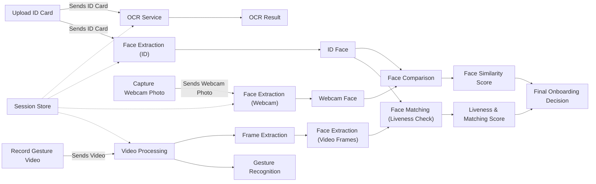

# Face Authentication System

A biometric verification system that authenticates users through facial recognition, document verification, and liveness checks.

## Overview

This system provides a comprehensive solution for remote user verification, particularly useful for banking operations like account opening and pension verification. It combines:

- Document verification (ID cards, licenses, etc.)
- Facial recognition
- Liveness detection through hand gesture verification

## Mermaid Diagrams



# Face Authentication System

## Project Overview
The **Face Authentication System** offers a secure and user-friendly method for remote identity verification through:
* **🪪 Document Verification**: Utilizing Optical Character Recognition (OCR) to validate ID cards and documents.
* **👤 Facial Recognition**: Matching user faces against uploaded documents.
* **✋ Liveness Detection**: Real-time gesture and movement verification to ensure authenticity.
* **🖥️ User Interface**: Providing a seamless interaction experience via Gradio or PyQt.
* **⚙️ Multi-Service Backend**: Leveraging FastAPI and BentoML for efficient model serving.

## Functionalities
### 1. Document Verification (OCR)
* **Text Extraction**: Extracts text from ID cards and documents using OCR technology.
* **Data Comparison**: Compares extracted data with user-provided input for validation.
* **Compliance**: Ensures adherence to Know Your Customer (KYC) and onboarding regulations.

### 2. Face Matching
* **Image Comparison**: Compares user facial images captured via webcam with those on official documents.
* **Embedding Techniques**: Employs embedding-based methods to achieve high accuracy in face matching.

### 3. Liveness Detection
* **Gesture Analysis**: Utilizes Mediapipe for real-time gesture recognition.
* **Spoof Detection**: Identifies and prevents spoofing attempts using static photos or video replays.
* **Frame Validation**: Implements frame-by-frame gesture validation to ensure user presence.

### 4. GUI Interface
* **Webcam Integration**: Facilitates webcam capture for real-time user interaction.
* **File Uploads**: Allows users to upload necessary documents securely.
* **Video Verification**: Supports video-based liveness verification processes.

### 5. Modular Model Serving
* **Service Modes**: Supports both FastAPI and BentoML for flexible model serving.
* **Deployment Flexibility**: Allows dynamic switching between local and remote models based on requirements.

### 6. Logging & Config Management
* **Unified Logging**: Implements Loguru for consistent and comprehensive logging.
* **Configuration Schema**: Utilizes Pydantic for flexible and reliable configuration management.

  
# Onboardly Installation Guide

Welcome to the **Onboardly** project. This guide will help you set up and run this banking automation system that enables remote customer onboarding with advanced fraud prevention features.

## Prerequisites

Before getting started, ensure you have:

1. **Python 3.12** installed
   - Download from the [official Python website](https://www.python.org/downloads/)

2. **`just`** command runner
   - Install via:
     ```bash
     sudo apt install just
     ```

3. **`uv`** package installer and environment manager
   - Install via:
     ```bash
     curl -LsSf https://astral.sh/uv/install.sh | sh
     ```

## Installation Steps

### Step 1: Set Up the Environment

Initialize your environment and install all required dependencies:

```bash
just setup
```

This command will set up your Python environment and install all necessary dependencies.

### Step 2: Start the Servers

#### Start All Servers Simultaneously

```bash
just start-all
```

This launches all servers in the background with logs written to:
- `logging_server.log`
- `backend_server.log`
- `backend_server_bento.log`
- `frontend_server.log`

To stop all servers:
```bash
just stop-all
```

#### Start Individual Servers

You can also start each server separately in different terminals:

```bash
# Start the Logging Server
just start-logging-server

# Start the FastAPI Application
just start-backend-server-fastapi

# Start the BentoML Server
just start-backend-server-bentoml

# Start the Frontend Server
just start-frontend-server
```

### Running the BentoML Server Independently

To start just the BentoML server:

```bash
just start-backend-server-bentoml
```

Or serve the BentoML project directly:

```bash
just serve_bm
```

## Accessing the System

- **Frontend**: http://localhost:7860/
- **API Documentation**: http://127.0.0.1:8000/
- **API Endpoints (Swagger UI)**: http://127.0.0.1:3000/docs

## API Endpoints Overview

### Session Management
- `/api/sessions/create-session`: Creates a new session
- `/api/sessions/cleanup`: Cleans up a session

### ID Processing and Verification
- `/api/id/upload-id`: Uploads and processes an ID card
- `/api/id/test-upload-id`: Test endpoint with pre-stored ID image
- `/api/id/capture-and-compare`: Compares captured face with ID face
- `/api/id/verify-gesture`: Verifies user's gesture for liveness check
- `/api/id/verify-gesture-from-stored-video`: Processes pre-stored video for gesture verification

## Testing the System

1. Create a session using `/api/sessions/create-session`
2. Upload an ID document via `/api/id/upload-id` or `/api/id/test-upload-id`
3. Capture and compare faces using `/api/id/capture-and-compare`
4. Verify gesture with `/api/id/verify-gesture` or `/api/id/verify-gesture-from-stored-video`
5. Clean up the session when finished with `/api/sessions/cleanup`

## Evaluation Methods

### 1. Sample Input Testing
- Test with valid IDs to verify OCR and face extraction
- Ensure reasonable similarity scores during face comparison
- Confirm proper gesture recognition and liveness checks

### 2. Log Review
- Check log files for errors or warnings:
  - `logging_server.log`
  - `backend_server.log`
  - `backend_server_bento.log`
  - `frontend_server.log`

### 3. Performance Evaluation
- Measure processing times for endpoints
- Verify robust error handling

### 4. Error Handling Tests
- Test calling endpoints out of sequence
- Verify appropriate error messages

### 5. Load Testing
Ensure the backend server is running, then execute:

```bash
just load_testing
```

This runs a Locust load test targeting the API. Access the Locust web interface at http://localhost:8089 to configure users and spawn rate.

# ✨ Experience and Learnings

## 🌟 What Worked Well
* **Centralized Logging**: Implementing Loguru for unified logging enhanced debugging and monitoring across the system.
* **Modular Design**: Structuring the project into distinct components improved maintainability and facilitated collaborative development.
* **FastAPI Integration**: Utilizing FastAPI provided high performance and streamlined API development, contributing to a responsive backend.

## 🧩 Challenges
* **Liveness Detection**: Ensuring accurate liveness detection to prevent spoofing attacks presented significant challenges, requiring advanced techniques to distinguish genuine user interactions from fraudulent attempts.
* **Data Privacy Concerns**: Handling and storing sensitive biometric data necessitated stringent security measures to protect user privacy and comply with regulatory standards.
* **Environmental Variations**: Addressing issues related to varying lighting conditions and backgrounds was essential to maintain consistent facial recognition accuracy.

## 💡 What We Learned
* **Advanced Anti-Spoofing Techniques**: Incorporating robust liveness detection mechanisms is crucial for enhancing the security of face authentication systems.
* **Privacy-Preserving Practices**: Implementing secure data handling protocols is vital to protect user information and build trust in the system.
* **Adaptability to Real-World Conditions**: Developing algorithms that perform reliably under diverse environmental conditions is essential for the practical deployment of facial recognition technology.

## 🔍 Project Difficulty
Overall, the project was **moderately challenging**. Integrating various technologies and ensuring their seamless operation required meticulous planning and testing. However, the resulting system is robust, offering secure and efficient face authentication capabilities.
